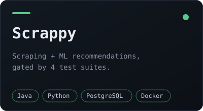
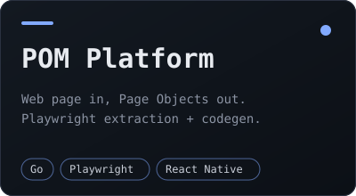
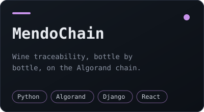

  

<h1 align="center">Santiago Martínez</h1>

  

📍 San Rafael, Mendoza, Argentina · 🟢 Open to new opportunities in QA automation

---

## About me

- I build test automation that gates delivery: suites that have to be green before a merge lands.
- Web, mobile and RPA automation on Python and Java, reported through Allure.
- Currently Test Automation Ssr at **DXC Technology**, previously at **Globant**.
- I orchestrate LLM agents (Claude Code, MCP servers, spec-driven development) from a Linux + Neovim setup.

## Tech stack

   
   
  

  
  
  
  
  
  
  
  

---

## Featured projects

<table>
  <tr>
    <td align="center" width="33%" valign="top">
      
       
      Full-stack scraping and recommendation platform with a real ML pipeline, built test-first. Four independent suites gate every merge: Maven backend, a 206-test CLI, a 113-test ML pipeline and the frontend.
        
      🔗 <a href="https://github.com/ssmartinezzz/Scrappy"><b>Repo</b></a>
    </td>
    <td align="center" width="33%" valign="top">
      
       
      Go microservices that open pages in a real browser, extract their interactive elements with Playwright and generate ready-to-run Page Object Model projects, with optional AI analysis through Ollama.
        
      🔗 <a href="https://github.com/ssmartinezzz/pom-platform"><b>Backend</b></a> · <a href="https://github.com/ssmartinezzz/pom-app"><b>App</b></a>
    </td>
    <td align="center" width="33%" valign="top">
      
       
      Wine traceability platform that tracks each bottle across the supply chain on-chain, with Algorand, Django REST and React, plus its own automated test suite.
        
      🔗 <a href="https://github.com/ssmartinezzz/MendoChain-Api"><b>API</b></a> · <a href="https://github.com/ssmartinezzz/MendoChainAutomatedTests"><b>Tests</b></a>
    </td>
  </tr>
</table>

---

## Experience

<b>DXC Technology</b> — Test Automation Ssr · Jul 2024 – Present

 

- Contributed to a web automation framework in Python with Pytest and Selenium, reporting through Allure.
- Built mobile test automation from scratch with Appium, following the Page Object Model.
- Designed and configured an Azure Pipelines workflow that runs test cases with custom parameters.
- Automated UiPath test cases for RPA solutions, and Excel automation with PyAutoGui and pandas.

<b>Globant</b> — Test Automation Jr · Mar 2022 – Jul 2024

 

- Developed a mobile automation framework with Java, Spring Boot, Selenium WebDriver and Appium.
- Expanded coverage by automating app functionality in JavaScript with WebdriverIO.
- Implemented CI/CD pipelines in Jenkins, integrating automated tests into the development workflow.
- Generated Allure reports to give stakeholders insight into application quality.

**Education** — Software Engineering, Universidad de Mendoza (2017–2023) · **English** — B2, Cambridge First Certificate

---

## GitHub activity

  

---

## Links

  
  

  

