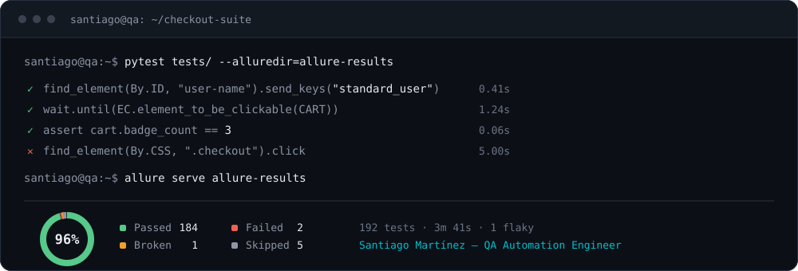

# Santiago Martínez

**QA Automation Engineer** — San Rafael, Mendoza, Argentina

I build test automation that gates delivery: suites that have to be green before
a merge lands. Web, mobile and RPA, on Python and Java.

[Portfolio](https://github.com/ssmartinezzz/qa-engineer-portfolio) · [LinkedIn](https://linkedin.com/in/ssmartinezzz)

> [!NOTE]
> Open to new opportunities in QA automation.

---

## Projects

**[Scrappy](https://github.com/ssmartinezzz/Scrappy)** — Java · Python · JavaScript · PostgreSQL · Docker

A full-stack scraping and recommendation platform with a real ML pipeline, built
test-first. It doubles as a case study in system-level test architecture:

- Four independent suites gate every merge — a Maven backend, a 206-test native
  CLI, a 113-test ML pipeline, and the frontend.
- The full suite must be green on every commit, so any point in history is a
  valid `git bisect` target.
- Ranking uses bounded weight multipliers anchored at 1.0 instead of hard
  filters, which keeps the existing suite valid as a regression net when new
  signals are added.

**[SauceDemo](https://github.com/ssmartinezzz/SauceDemo)** — Java · Selenium

Page Object Model implementation automating the SauceDemo web app end to end.

**MendoChain** — Python · Algorand SDK · React · Django REST

Wine traceability platform tracking each bottle across the supply chain on-chain.

---

## Experience

**DXC Technology** — Test Automation Ssr · Jul 2024 – Present

- Contributed to a web automation framework in Python with Pytest and Selenium,
  reporting through Allure.
- Built mobile test automation from scratch with Appium, following the Page
  Object Model.
- Designed and configured an Azure Pipelines workflow that runs test cases with
  custom parameters.
- Automated UiPath test cases for RPA solutions, and Excel automation with
  PyAutoGui and pandas.

**Globant** — Test Automation Jr · Mar 2022 – Jul 2024

- Developed a mobile automation framework with Java, Spring Boot, Selenium
  WebDriver and Appium.
- Expanded coverage by automating app functionality in JavaScript with
  WebdriverIO.
- Implemented CI/CD pipelines in Jenkins, integrating automated tests into the
  development workflow.
- Generated Allure reports to give stakeholders insight into application quality.

---

## Stack

| | |
|---|---|
| **Languages** | Java · Python · JavaScript |
| **Test frameworks & runners** | Selenium · WebdriverIO · Appium · Pytest · TestNG · JUnit |
| **CI/CD & reporting** | Azure Pipelines · Jenkins · Git · Allure |
| **Low-code platforms** | UiPath · Virtuoso QA |
| **LLM orchestration & Linux** | Claude Code · MCP servers · multi-agent orchestration · spec-driven development · herdr · Ghostty · Neovim/LazyVim · Bash/Zsh |

---

**Education** — Software Engineering, Universidad de Mendoza (2017–2023)

**English** — B2, Cambridge First Certificate
